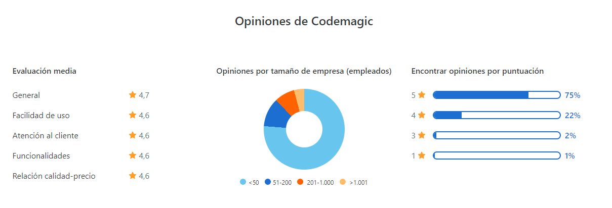
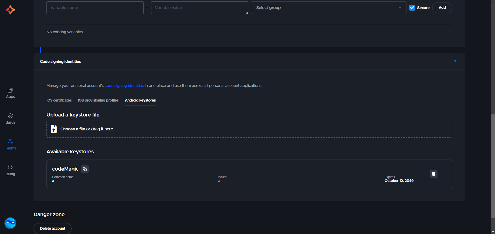
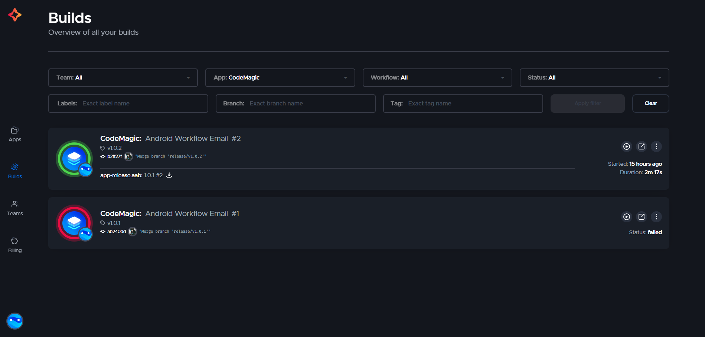

# Despliegue de Apps Android con CodeMagic CI/CD

<p align="center">
    
</p>

## ¿Qué es Codemagic?

Codemagic es una herramienta en la nube para automatizar la creación y entrega de aplicaciones móviles, compatible con Flutter, React Native, Android, iOS y otras plataformas. Es fácil de usar y útil para equipos que personalizan apps.

## Opiniones de Codemagic:

<p align="center">
    
</p>

## Implementación

Este proyecto implementará configuraciones básicas y gestión de ramas utilizando Gitflow. Al realizar un push a la rama **"main"**, se ejecutarán automáticamente varios procesos, incluyendo limpieza, revisión de pruebas y generación del archivo **".aab"**. Además, se enviará un correo con el archivo ya compilado.

**⚠️ Considerar:**

Si deseas profundizar en el manejo de Gitflow, puedes consultar este artículo: [Gitflow](https://medium.com/p/568f126a80cf)

## 📝 Primeros pasos:

1. Al crear el proyecto, es necesario generar un archivo llamado **codemagic.yaml**, que establece la conexión con la plataforma Codemagic. Una vez creado, se habilita el puente para realizar las llamadas necesarias.

   ```yaml
   workflows:
     android-workflow:
       name: Android Workflow Email
       max_build_duration: 60

       environment:
         vars:
           EMAIL_RECIPIENT: "leccbo1995@gmail.com"
         android_signing:
           - codeMagic

       scripts:
         - name: Check for gradlew
           script: ls -la

         - name: Set execute permissions for gradlew
           script: chmod +x ./gradlew

         - name: Run Unit Tests
           script: ./gradlew test

         - name: Check Code
           script: ./gradlew check

         - name: Build Android App Bundle
           script: ./gradlew bundleRelease

       artifacts:
         - app/build/outputs/bundle/release/app-release.aab

       publishing:
         email:
           recipients:
             - leccbo1995@gmail.com
           notify:
             success: true
             failure: true

       triggering:
         events:
           - tag
2. Después, debemos configurar Codemagic en su plataforma, realizando algunos ajustes, como la configuración del bundle y los webhooks, los cuales se mostrarán en las siguientes imágenes:<br><br>

    1. Para firmar la aplicación, utilizamos esta sección para que, al realizar el push, las firmas se gestionen a través de Codemagic utilizando nuestra clave previamente creada.<br><br>
        <p align="center">
            
        </p><br>
    2. Después de hacer un push a la rama principal, se iniciará el proceso definido en el archivo mencionado anteriormente. El resultado, ya sea error o aprobación, se mostrará de la siguiente manera:<br><br>
        <p align="center">
                
        </p><br>

## 💭 Tener en cuenta:

1. La plantilla que comparto es una base para un proceso simple de CI/CD.
2. La plantilla, por defecto, realiza push solo a la rama principal.
3. Se puede configurar para múltiples ramas o para una rama específica según lo necesites.
4. Ten en cuenta que el artículo en Medium incluirá más detalles, ya que esto solo cubre los aspectos básicos.

## 🔗 Links:

1. [Documentación de Codemagic](https://docs.codemagic.io/?utm_source=app&utm_campaign=main-page&_gl=1*yf18d8*_gcl_au*MTYwNDI5NTg0LjE3MjYzMDY1NzE)
2. [Plataforma de Codemagic](https://codemagic.io/start/)
3. [Medium]()
4. [GitHub](https://github.com/leandro1995/CodeMagic/tree/main)